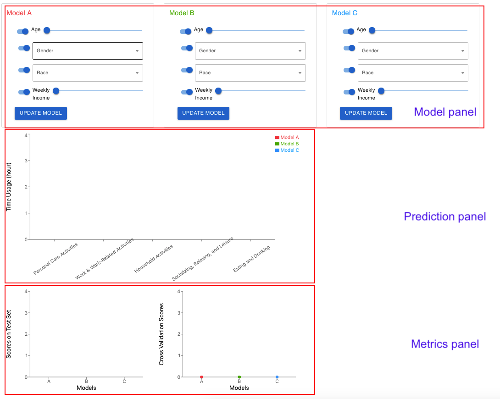

# ATUS Interactive Predictor Webpage

## Usage

```
pip3 install -r requirements.txt
python3 app.py
```
On a separate terminal
```
cd client
npm install
npm start
```

## Video demo

Video link: https://uwmadison.box.com/s/m0ls9ss0ooxugw17hpfennvc2c2qbyp6

## Instructions

(Also in [`instructions.pdf`](https://github.com/yiyins2/ATUS_Interactive_Predictor_Web/blob/main/instructions.pdf))


1. For Model A in the model panel
  * Switch on/off a feature to indicate whether you want to include/exclude this feature in the model
  * Input the values you want to use in the prediction. For example, Age: 42 | Gender: Female | Race: Black | Weekly income: 6K (in cents). 
  * Note that as long as you have a feature in the mode, you have to specify that feature’s value before moving on. 
2. Click the “update model” button. 
3. Do the same thing for Model B and Model C. 


